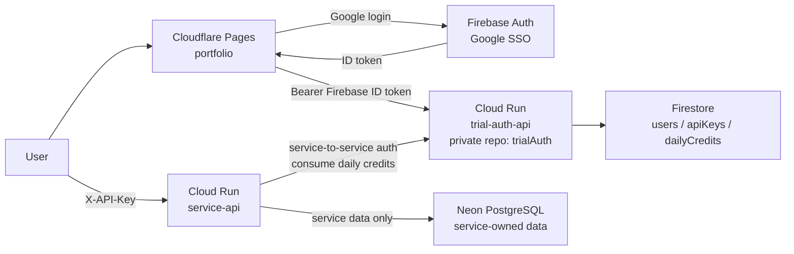
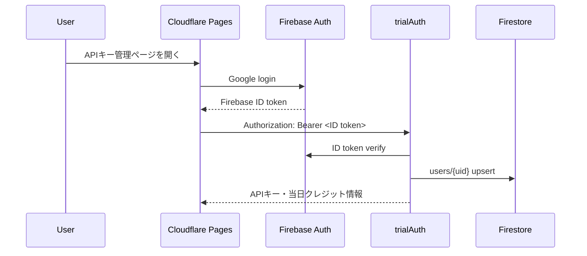
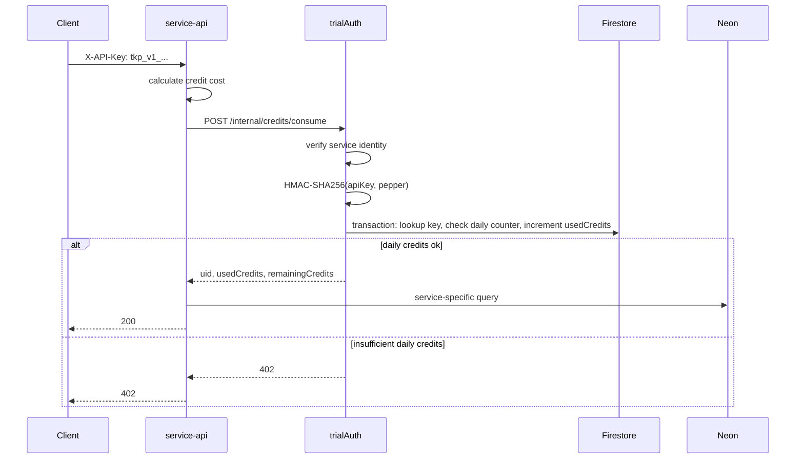

# Personal Homepage and TrialAuth Architecture

## 目的

個人ホームページは、非商用の個人開発・研究・技術活動をまとめる静的ポータルとする。プロフィールサイトを中心にしつつ、APIキーが必要な小規模バックエンドサービスへの入口も提供する。

主な責務は次のとおり。

- プロフィール、経歴、スキル、制作物、研究・開発実績、連絡先の掲載
- 技術ブログ、主要プロジェクト詳細、研究紹介の掲載
- 個人開発プロジェクトへのリンク集
- Googleログインによる本人確認
- APIキーの発行、状態確認、無効化
- 当日の残りクレジット表示
- 個人開発サービス利用時の日次クレジット消費
- 検索エンジンおよびAI検索に読まれやすい情報整理

ホームページ本体は可能な限り静的配信を維持し、認証、APIキー、日次クレジット管理は別リポジトリの `trialAuth` バックエンドに切り出す。

このサイトは商用サービスの販売、課金、広告配信基盤、SLA提供を目的としない。APIキーは課金管理ではなく、個人開発バックエンドへの異常通信、外部APIコストの暴走、乱用を抑えるために使う。

## 対象範囲

### 対象に含めるもの

- 個人プロフィール
- 経歴
- スキル
- 研究・開発実績
- 個人開発プロジェクト一覧
- GitHub / SNS / 連絡先リンク
- 技術ブログ
- APIキー発行、確認、無効化
- 当日の残りクレジット表示
- AI検索向けの `llms.txt`
- 主要プロジェクト、主要記事の Markdown 版ページ

### 対象に含めないもの

- 決済機能
- 有料プラン
- サブスクリプション
- 法人向け管理画面
- 顧客管理
- 商用SLA
- 請求書発行
- 広告配信基盤
- 高度な不正検知
- 大規模ユーザー管理
- 複数APIキー発行
- チーム、組織アカウント

## 採用構成

| 領域             | 採用技術                  | 役割                                         |
| ---------------- | ------------------------- | -------------------------------------------- |
| 個人ホームページ | Cloudflare Pages          | 静的ページ配信、APIキー管理UI                |
| UI               | React, TypeScript, MUI    | 既存ポートフォリオUIの拡張                   |
| 認証             | Firebase Auth, Google SSO | APIキー取得時だけ本人確認                    |
| 共通バックエンド | Cloud Run, Go             | `trialAuth` として別の非公開リポジトリで管理 |
| 共通データ       | Firestore                 | users, apiKeys, apiKeyLookups, dailyCredits  |
| 個別サービスAPI  | Cloud Run                 | pdf2jpg-api などの実API                      |
| SQL DB           | Neon PostgreSQL           | 各サービス固有データのみ                     |
| SEO              | sitemap.xml, robots.txt   | 検索エンジン向けメタデータ                   |
| AI検索対策       | llms.txt, Markdown pages  | AIエージェント向けの読みやすい情報源         |

Cloudflare Pages Functions / Workers は、この設計では共通認証基盤として使わない。Firebase Admin SDK、APIキー検証、日次クレジット消費、Firestore 更新を `trialAuth` に集約し、Cloudflare Pages は静的配信とクライアントUIに限定する。

## リポジトリ構成

```txt
ttokunaga-ja/portfolio
  visibility: public
  role: static homepage, API key management UI

ttokunaga-ja/trialAuth
  visibility: private
  role: Firebase token verification, API key management, daily credit counter
```

`trialAuth` は非公開リポジトリにする。これにより、APIキー検証、HMAC pepper の扱い、日次クレジット消費処理、内部APIの詳細が公開検索や自動スキャンから見えにくくなる。

ただし、非公開リポジトリは主防御ではない。ソースが漏れても破綻しない前提で、認証、IAM、Secret Manager、CORS、ログマスキング、入力検証、レート制限を必ず実装する。

Cloud Run service name は lowercase が扱いやすいため、実行環境名は `trial-auth-api` とする。リポジトリ名とプロダクト名は `trialAuth` とする。

## 全体アーキテクチャ



## 境界

### Cloudflare Pages

Cloudflare Pages は静的サイトを配信する。

- プロフィール、経歴、スキル、制作物、研究、連絡先は静的HTMLとして配信する。
- 技術ブログ、プロジェクト詳細、Markdown 版ページ、`llms.txt` も静的ファイルとして配信する。
- APIキー管理ページもルート自体は静的に配信する。
- APIキー管理ページのログイン状態、キー発行、当日の残りクレジット取得だけをクライアント側で実行する。
- Firebase の Web config は公開前提の設定として扱う。
- ID token、API key、OAuth token をビルド成果物やログに残さない。

### Firebase Auth

Firebase Auth は Google SSO 専用とする。

- APIキーの発行、状態確認、無効化、当日クレジット表示時にログインを要求する。
- パスワード認証は使わない。
- OAuth access token は保存しない。
- クライアントは Firebase ID token を取得し、`trialAuth` の公開APIに送信する。

### trialAuth

`trialAuth` は共通認証、APIキー管理、日次クレジット管理専用の Cloud Run サービスとする。

- Firebase Admin SDK で ID token を検証する。
- Firestore の users, apiKeys, apiKeyLookups, dailyCredits を管理する。
- APIキーの平文は発行レスポンスで一度だけ返す。
- APIキーの平文を Firestore、ログ、メトリクスに保存しない。
- 個別サービスからの内部API呼び出しを Cloud Run service-to-service auth で検証する。
- CORS は個人ホームページの origin のみに限定する。

### service-api

各個人開発サービスは独立した Cloud Run サービスとして公開する。

- `X-API-Key` ヘッダーでAPIキーを受け取る。
- APIキー検証と日次クレジット消費は `trialAuth` の内部APIに委譲する。
- service-api は Firestore、API key pepper、users collection に直接アクセスしない。
- 利用可能な場合だけサービス固有処理を実行する。
- SQL が必要な場合だけ Neon PostgreSQL に接続する。
- Neon にはAPIキー、共通認証情報、日次クレジットカウンタを保存しない。

## ホームページ本体

### 役割

ホームページ本体は、個人活動の入口となる静的ポータルサイトとする。

推奨ルートは次のとおり。

```txt
/
  トップページ

/profile/
  自己紹介、経歴、スキル、所属、研究関心

/projects/
  個人開発プロジェクト一覧

/projects/{slug}/
  各プロジェクト詳細

/research/
  研究・学習・実験成果

/blog/
  技術記事一覧

/blog/{slug}/
  技術記事詳細

/api-keys/
  APIキー管理ページ

/contact/
  GitHub / SNS / Email への導線

/llms.txt
  AI検索向けサイト案内

/projects/{slug}.md
  主要プロジェクトのMarkdown版

/blog/{slug}.md
  主要記事のMarkdown版
```

バックエンド通信が不要なページは完全静的配信とする。APIキー管理ページもルート自体は静的にし、Firebase Auth と `trialAuth` への通信だけをクライアント側の動的処理にする。

### 通常SEO

各ページには以下を設定する。

```txt
title
meta description
h1
h2
OGP image
canonical URL
sitemap.xml
robots.txt
```

プロジェクト詳細ページは、検索エンジンと人間の両方に読みやすいよう、構成をそろえる。

```txt
一言でいうと
解決する課題
主な機能
使用技術
工夫した点
公開リンク
GitHubリンク
よくある質問
```

### AI検索向け

AI検索やAIエージェントに読まれやすくするため、以下を静的に公開する。

```txt
/llms.txt
/projects/{slug}.md
/blog/{slug}.md
```

Markdown版は通常検索で重複ページ扱いされないよう、原則として `noindex` を付与し、HTML版を canonical にする。

```txt
Content-Type: text/markdown; charset=utf-8
X-Robots-Tag: noindex
Link: <https://takumi-tokunaga.com/projects/example/>; rel="canonical"
```

`llms.txt` には、AI向けに重要ページと主な技術領域を案内する。

```md
# Takumi Tokunaga Portfolio

このサイトは、徳永拓未の個人開発、研究、技術記事、ポートフォリオをまとめた非商用の個人ホームページです。

## 重要ページ

- [プロフィール](https://takumi-tokunaga.com/profile/)
- [プロジェクト一覧](https://takumi-tokunaga.com/projects/)
- [研究](https://takumi-tokunaga.com/research/)
- [技術ブログ](https://takumi-tokunaga.com/blog/)

## 主な技術領域

- Go
- Python
- React
- Cloud Run
- Firebase
- Firestore
- Neon PostgreSQL
- RAG
- AI
- VR / Unity
- 教育支援システム
```

## 静的プロジェクトとAPIキー要否

バックエンド通信やDBを使用しない静的プロジェクトでは、APIキーを要求しない。

APIキー不要の例:

```txt
ポートフォリオページ
静的デモ
LP
ドキュメントサイト
ブログ
研究紹介ページ
成果物紹介ページ
GitHub Pages 的な静的作品
```

APIキーが必要になる条件:

```txt
Cloud Run APIを呼び出す
Neon PostgreSQLを使う
Firestore上の日次クレジット制限を使う
サーバー側で重い処理を行う
AI APIなど外部APIのコストが発生する
```

## 認証設計

### フロー



### Firestore: users

```txt
users/{uid}
  uid: string
  email: string
  displayName: string
  provider: "google.com"
  createdAt: timestamp
  lastLoginAt: timestamp
```

`email` と `displayName` はAPIキー管理画面の本人確認表示に必要な最小限の情報として保存する。不要なプロフィール画像URL、OAuth token、Google側の追加属性は保存しない。

## APIキー設計

### 基本方針

- 1 Googleアカウントにつき、同時に有効なAPIキーは1つだけ。
- APIキーは発行時に一度だけ表示する。
- APIキーの再表示はできない。
- 漏えい時は無効化し、再発行する。
- Firestore にはAPIキー平文ではなく HMAC-SHA-256 の結果だけを保存する。

厳密には「1 Googleアカウント = 1 active APIキー」と定義する。失効済みキーを再発行不能にすると漏えい時に復旧できないため、`revoked=true` の場合は同じ `apiKeys/{uid}` を更新して新しいキーへ差し替える。

発行処理は `apiKeys/{uid}` と `apiKeyLookups/{keyHash}` を対象にした Firestore transaction で行い、同時リクエストでも複数の有効キーが作られないようにする。

### キー生成

APIキーは Go の `crypto/rand` で 32 bytes 以上の乱数を生成し、base64url でエンコードする。

表示形式の例:

```txt
tkp_v1_<base64url-random>
```

保存するハッシュ:

```txt
keyHash = HMAC-SHA256(apiKey, API_KEY_PEPPER)
```

`API_KEY_PEPPER` は Secret Manager に保存する。`trialAuth` だけが pepper を読み込み、個別 service-api には pepper を渡さない。

### Firestore: apiKeys

```txt
apiKeys/{uid}
  uid: string
  keyHash: string
  keyHashVersion: number
  keyPrefix: string
  revoked: boolean
  createdAt: timestamp
  lastUsedAt: timestamp | null
  revokedAt: timestamp | null
  rotatedAt: timestamp | null
```

`keyPrefix` は管理画面やログで識別するための短い非機密値とする。平文APIキー全体や末尾文字列は保存しない。

### Firestore: apiKeyLookups

```txt
apiKeyLookups/{keyHash}
  uid: string
  keyHashVersion: number
  revoked: boolean
  createdAt: timestamp
  revokedAt: timestamp | null
```

APIキー検証時に `keyHash` から `uid` を高速に引くための lookup collection とする。document id は HMAC 済みの値であり、APIキー平文ではない。

## 日次クレジット設計

### 方針

固定の「1日10回」制限は採用しない。代わりに、1 Googleアカウントごとに毎日100クレジットを利用可能にする。

```txt
1 Googleアカウント = 1日100クレジット
```

履歴台帳は持たない。管理画面では当日の `usedCredits` と `remainingCredits` だけを表示する。過去の利用履歴、直近履歴、監査用 ledger は MVP では実装しない。

日付は日本時間の `yyyyMMdd` を使う。個人サイトの利用者が日本時間で日次上限を理解しやすく、`dailyCredits/{uid_yyyyMMdd}` のIDと表示が一致するため。

### Firestore: dailyCredits

```txt
dailyCredits/{uid_yyyyMMdd}
  uid: string
  date: string
  usedCredits: number
  dailyLimit: number
  createdAt: timestamp
  updatedAt: timestamp
  expiresAt: timestamp
```

`dailyLimit` は通常 `100` とする。ユーザー別の例外を作りたくなった場合に備えて、document にも保存しておく。

`expiresAt` は Firestore TTL を有効化する場合に使う。履歴確認は不要なので、保持期間は短くてよい。例として7日から30日程度を想定する。

### クレジット消費量

service-api は処理量に応じて `cost` を計算し、`trialAuth` に渡す。MVP ではサービスごとの固定値でもよい。

例:

```txt
pdf2jpg-api
  1 page = 1 credit
  max cost per request = 20 credits
```

`trialAuth` 側でも `cost` が `1..MAX_CREDITS_PER_REQUEST` の範囲にあることを検証する。service-api が不正な cost を渡しても、100クレジットを超える消費や負数消費ができないようにする。

### クレジット消費フロー



消費処理は Firestore transaction で行う。

1. `apiKeyLookups/{keyHash}` を読む。
2. `apiKeys/{uid}` を読み、失効状態を確認する。
3. 日本時間で `yyyyMMdd` を計算する。
4. `dailyCredits/{uid_yyyyMMdd}` を読む。
5. document がなければ `usedCredits=0`, `dailyLimit=100` として扱う。
6. `usedCredits + cost > dailyLimit` なら `402 Payment Required` を返す。
7. `usedCredits + cost` を保存する。
8. `apiKeys/{uid}.lastUsedAt` を更新する。

二重送信対策は履歴台帳を持たないため完全な idempotency ではなく、サービス側の request timeout / retry 設計で扱う。MVP では「`trialAuth` への消費リクエストを投げたら消費済み」とし、service-api は同じユーザー操作で自動再送をしない。

## trialAuth 公開API仕様

公開APIは Cloudflare Pages の APIキー管理UIから呼ばれる。すべてのエンドポイントで `Authorization: Bearer <Firebase ID token>` を必須とする。

### POST /api/keys

APIキーを発行する。

- 未発行の場合: 新規発行して平文APIキーを一度だけ返す。
- 有効なキーが存在する場合: 新規発行せず、メタデータだけ返す。
- 失効済みの場合: 新しいキーを発行し、同じ `apiKeys/{uid}` を更新する。
- クレジット付与処理は不要。日次クレジットは `dailyCredits/{uid_yyyyMMdd}` のカウンタで自然に扱う。

Response:

```json
{
  "hasKey": true,
  "apiKey": "tkp_v1_xxxxx",
  "keyPrefix": "tkp_v1_x",
  "revoked": false,
  "createdAt": "2026-06-04T00:00:00Z",
  "dailyCredits": {
    "date": "20260604",
    "dailyLimit": 100,
    "usedCredits": 0,
    "remainingCredits": 100
  }
}
```

既存の有効キーがある場合、`apiKey` は `null` とする。

### GET /api/keys/me

自分のAPIキー状態を取得する。

Response:

```json
{
  "hasKey": true,
  "keyPrefix": "tkp_v1_x",
  "revoked": false,
  "createdAt": "2026-06-04T00:00:00Z",
  "lastUsedAt": null
}
```

### POST /api/keys/revoke

自分のAPIキーを無効化する。

Response:

```json
{
  "hasKey": true,
  "revoked": true,
  "revokedAt": "2026-06-04T00:00:00Z"
}
```

### GET /api/credits/today

自分の当日クレジット状態を取得する。

Response:

```json
{
  "date": "20260604",
  "dailyLimit": 100,
  "usedCredits": 13,
  "remainingCredits": 87
}
```

## trialAuth 内部API仕様

内部APIは Cloud Run service-to-service auth を必須とし、許可済み service account からの呼び出しだけを受け付ける。ブラウザからは呼べない。

### POST /internal/credits/consume

APIキーを検証し、当日のクレジットを消費する。

Request:

```json
{
  "apiKey": "tkp_v1_xxxxx",
  "serviceName": "pdf2jpg-api",
  "cost": 3,
  "requestId": "request-uuid"
}
```

Response:

```json
{
  "authorized": true,
  "uid": "firebase-uid",
  "serviceName": "pdf2jpg-api",
  "date": "20260604",
  "cost": 3,
  "dailyLimit": 100,
  "usedCredits": 13,
  "remainingCredits": 87
}
```

## service-api 共通仕様

各個人開発サービスは次の共通認可処理をリクエスト入口で実行する。

### Header

```txt
X-API-Key: tkp_v1_...
```

APIキーをURL queryやログに残りやすい場所で受け取らない。

### 成功時にサービス処理へ渡す情報

```txt
uid
serviceName
creditCost
dailyLimit
usedCredits
remainingCredits
requestId
```

### エラー

| HTTP | code                   | 意味                        |
| ---- | ---------------------- | --------------------------- |
| 400  | `API_KEY_MISSING`      | `X-API-Key` がない          |
| 400  | `INVALID_CREDIT_COST`  | cost が不正、または上限超過 |
| 401  | `API_KEY_INVALID`      | ハッシュ照合に失敗          |
| 403  | `API_KEY_REVOKED`      | キーが失効済み              |
| 402  | `INSUFFICIENT_CREDITS` | 当日の残りクレジット不足    |
| 500  | `INTERNAL_ERROR`       | Firestore などの内部エラー  |

## Firestore インデックス

APIキー検証は `apiKeyLookups/{keyHash}` の document read で行う。日次クレジットも `dailyCredits/{uid_yyyyMMdd}` の document read/write で行う。そのため、MVP では追加の複合インデックスは不要。

## Firestore Security Rules

クライアントから Firestore を直接読ませない。Cloud Run の Admin SDK だけが Firestore にアクセスする。

```txt
rules_version = '2';
service cloud.firestore {
  match /databases/{database}/documents {
    match /{document=**} {
      allow read, write: if false;
    }
  }
}
```

## IAM とサービス境界

### trialAuth service account

- Firebase Admin SDK を使った ID token verification
- Firestore read/write
- Secret Manager `API_KEY_PEPPER` access

### service-api service account

- Cloud Run invoker for `trial-auth-api`
- Service-specific Neon credential access

service-api には Firestore 権限と `API_KEY_PEPPER` へのアクセス権を与えない。APIキー検証と日次クレジット消費を `trialAuth` に集約することで、個別サービスの攻撃面を小さくする。

## フロントエンド設計

APIキー管理ページは静的ルートとして追加する。

推奨ルート:

```txt
/api-keys/
```

表示状態:

- 未ログイン: Googleログインボタン
- ログイン済み、未発行: 発行ボタン
- 発行直後: APIキーを一度だけ表示、コピー操作を提供
- 有効キーあり: `keyPrefix`, `createdAt`, `lastUsedAt`, 当日の残りクレジット、無効化ボタン
- 失効済み: 失効日時、再発行ボタン
- 残りクレジット不足: 当日のクレジットを使い切ったことを表示

APIキー平文は localStorage に保存しない。発行直後の画面表示とユーザー操作によるコピーに限定する。

履歴確認は不要なので、利用履歴、直近履歴、過去日の一覧は表示しない。

## CORS とセキュリティヘッダー

`trialAuth` の公開APIは次の origin だけを許可する。

```txt
https://takumi-tokunaga.com
http://localhost:<dev-port>
```

開発用 origin は環境変数で分け、本番環境には本番 origin だけを入れる。

Cloudflare Pages 側の CSP では Firebase Auth、`trialAuth`、必要な静的アセットの接続先だけを許可する。APIキーや ID token をログ出力しないため、クライアントエラー収集を導入する場合もリクエストヘッダーを送信対象から除外する。

## 環境変数

### Cloudflare Pages

```txt
VITE_FIREBASE_API_KEY
VITE_FIREBASE_AUTH_DOMAIN
VITE_FIREBASE_PROJECT_ID
VITE_FIREBASE_APP_ID
VITE_TRIAL_AUTH_API_BASE_URL
```

Firebase Web config は公開情報だが、環境ごとの差し替えのために変数化する。

### trialAuth

```txt
GOOGLE_CLOUD_PROJECT
FIREBASE_PROJECT_ID
ALLOWED_ORIGINS
API_KEY_PEPPER_SECRET_NAME
DAILY_CREDIT_LIMIT=100
MAX_CREDITS_PER_REQUEST
ALLOWED_SERVICE_ACCOUNTS
```

### service-api

```txt
SERVICE_NAME
TRIAL_AUTH_INTERNAL_BASE_URL
NEON_DATABASE_URL
```

## デプロイ

### ホームページ

既存の Cloudflare Pages Direct Upload を継続する。

```txt
GitHub Actions
  pnpm build
  wrangler pages deploy dist
```

### trialAuth

`ttokunaga-ja/trialAuth` を非公開リポジトリとして作成し、Cloud Run に Go API としてデプロイする。

```txt
trialAuth
  /cmd/server
  /internal/auth
  /internal/apikey
  /internal/credits
  /internal/firestore
  /internal/http
```

GitHub repository は private にし、少なくとも次を設定する。

- branch protection
- secret scanning
- Dependabot security updates
- GitHub Actions secrets for GCP deploy
- CODEOWNERS または protected review rule
- public fork を許可しない運用

### service-api

各サービスは独立リポジトリまたは独立ディレクトリで Cloud Run にデプロイする。APIキー検証ロジックは持たず、`trialAuth` の内部APIを呼ぶ薄い client だけを実装する。

## 運用ルール

- APIキー平文は発行レスポンス以外に出さない。
- ログにはAPIキー、ID token、OAuth tokenを出さない。
- 障害調査用ログでは `uid`, `serviceName`, `keyPrefix`, `requestId`, `date`, `cost` だけを使う。
- `API_KEY_PEPPER` をローテーションする場合は、旧pepperと新pepperの二重検証期間を設ける。
- `dailyCredits` は履歴確認に使わない。TTL で短期削除する。
- `trialAuth` の内部APIは Cloud Run IAM で service-api の service account だけに許可する。

## MVP実装順序

### Phase 1: 静的ホームページ

```txt
1. トップページを整える
2. プロフィールページを整える
3. プロジェクト一覧を整える
4. プロジェクト詳細ページを整える
5. 研究・技術ブログ・連絡先導線を整える
6. sitemap.xml / robots.txt / OGP / canonical を整える
```

### Phase 2: trialAuth 基盤

```txt
1. 非公開 GitHub repository ttokunaga-ja/trialAuth を作成する
2. Firebase project と Google SSO を設定する
3. Secret Manager に API_KEY_PEPPER を作成する
4. Firestore の users / apiKeys / apiKeyLookups / dailyCredits を用意する
5. Cloud Run trial-auth-api を作成する
```

### Phase 3: APIキー管理UI

```txt
1. /api-keys/ ルートを追加する
2. Firebase Googleログインを追加する
3. POST /api/keys と接続する
4. GET /api/keys/me と接続する
5. POST /api/keys/revoke と接続する
6. GET /api/credits/today で当日残りクレジットを表示する
```

### Phase 4: 日次100クレジット制限

```txt
1. trialAuth の /internal/credits/consume を実装する
2. Cloud Run service-to-service auth を必須にする
3. Firestore Transaction で dailyCredits/{uid_yyyyMMdd} を更新する
4. cost が 1..MAX_CREDITS_PER_REQUEST の範囲内か検証する
5. usedCredits + cost > 100 の場合は拒否する
```

### Phase 5: 個別サービス連携

```txt
1. pdf2jpg-api など最初のサービスを Cloud Run に配置する
2. X-API-Key を受け取る
3. trialAuth client で /internal/credits/consume を呼ぶ
4. 成功時だけサービス本体の処理を実行する
5. 必要なサービスだけ Neon PostgreSQL に接続する
```

### Phase 6: AI検索向け強化

```txt
1. /llms.txt を作成する
2. 主要プロジェクトの Markdown 版を作成する
3. 主要記事の Markdown 版を作成する
4. Markdown版に noindex + canonical を付与する
5. README / GitHub / ホームページの内容を揃える
```

## 採用しないもの

| 技術・方針                        | 採用しない理由                                  |
| --------------------------------- | ----------------------------------------------- |
| Cloud SQL                         | 固定費が高く、個人・小規模用途に合わない        |
| Neon への共通認証保存             | サービス固有DBと共通認証基盤が混ざる            |
| APIキー平文保存                   | 漏えい時の被害が大きい                          |
| 静的プロジェクトへのAPIキー要求   | バックエンド通信やDBがないため不要              |
| APIキーのURL query受け渡し        | ログ、履歴、Refererに残りやすい                 |
| 日次10回の固定制限                | 処理量の違うサービスを公平に扱えない            |
| クレジット履歴台帳                | 今回は履歴確認が不要で、日次カウンタで足りる    |
| service-api から Firestore 直読み | pepper と認可ロジックが各サービスに分散するため |
| 商用課金・契約管理                | 非商用の個人開発ポータルには過剰                |

## 最終判断

この構成は、ホームページ本体を静的・低コストに保ちつつ、認証、APIキー、日次100クレジット管理を `trialAuth` に集約できる。`trialAuth` を非公開リポジトリにすることで実装詳細の露出を抑え、さらに service-api から Firestore と pepper を切り離すことで攻撃面を小さくする。

履歴台帳は持たず、`dailyCredits/{uid_yyyyMMdd}` の日次カウンタだけで制限する。要件上、利用履歴の確認が不要であれば、この方式が最も単純で運用コストも低い。
